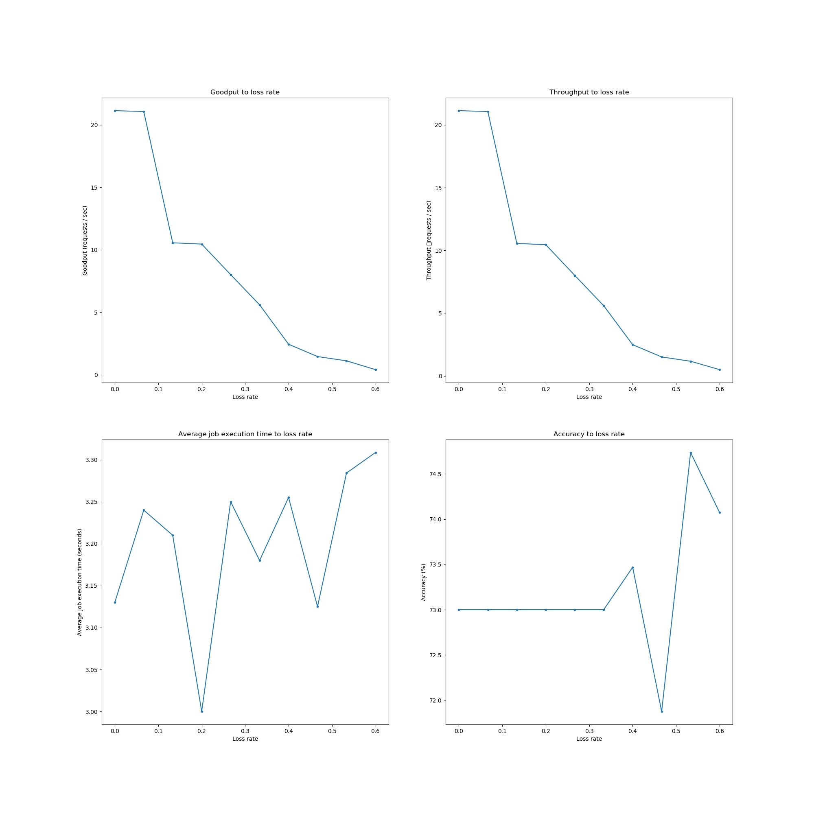

# **CS655 Image Recognition System**

## **Project Description**
The general purpose of this project is to implement an image recognition service (**scalable**) with a web interface. In our design, we plan to implement a server node which manages all jobs and schedules them to worker nodes.  Users will use the web interface to submit jobs to the service node and get results. In worker nodes, we will implement a worker service to interact with the server node and image recognition component. 

## **Motivation & learning outcomes**
* We want to learn how to build a **scalable**, **stable**, **fast**, **easy to use** image recognition system with **Restful APIs**.
* We can learn how to use **NodeJS** to build a http service, handle different types of requests (GET, POST(with binary file), DELETE etc.).
* We can learn how to build the **responsive** web interface as a **Single Page Application** (SPA) by using **React.js**.
* We can learn how to deploy a deep learning model.
* We can get familiar with **TypeScript** by using it to build all the JavaScript applications.

## **Assumptions**
* Maximum Query Per Second (QPS)
  * 100 QPS
* Users cannot attack our network, neither adding traffic nor disable the network.
* Users will not do stress testing on our APIs, they can only access the service from the web front-end user interface.


## **Main Features**
* Fully scalable system, you can add or remove any number of worker nodes at any time, the system will keep stable.
* Restful APIs.
* SPA implementation for the web interface.
* Fast prediction, beneifit of using MobileNet.
* Automatically reschedule a job if its worker is down.

## **Design & Setup**
* Setup diagram
  
* Environment & resources
  * Number of worker nodes: 4
  * Server node: Xen VM, Ubuntu 18.04 LTS, no GPUs, 1024MB RAM, 16G Hard Drive
  * Worker node: Xen VM, Ubuntu 18.04 LTS, no GPUs, 1024MB RAM, 16G Hard Drive
  * Link Bandwidth: 100Mbit/sec
  * Server’s language / framework: Node.js, TypeScript
  * Worker’s language / framework: Node.js, TypeScript, Python 3
  * Web interface’s language / framework: React.js, TypeScript
  * Relational database: Maria DB
  * Pre-trained image recognition model: MobileNet V2, since we do not have GPUs on our worker nodes.
  * Testing data set: [ILSVRC2012 validation images (first 100 images)](https://drive.google.com/file/d/1-X6t402uX-4Ol7EtszGdA7-_ywSstCV8/view?usp=sharing), since this data set cannot be published, so the download link here can only be accessible by Boston University members, log in your BU account to get it.

## **Execution & results**
* Configuration & usage
  * See [**Step-by-Step Instructions**](#step-by-step-instructions) below.
* Metrics, graphs and analysis
  * Metrics:
    * We measured the throughput (number of HTTP requests per second), goodput, accuracy, average job execution time over the loss rates = [0 , 0.067, 0.13, 0.2, 0.27, 0.33, 0.4, 0.47, 0.53, 0.6], and tested with 100 images per loss rate.
    * The loss rates were set on the link between client and the master node.
  * Graph: 
    
  * Table:
    | Loss rate | Goodput(req/sec) | Throughput(req/sec) | Accracy | avg execution time(sec)|
    |---|---|---|---|---|
    | 0.0 | 21.133923636182242 | 21.133923636182242 | 0.73 | 3.13 |
    |0.06666666666666667 | 21.060821040334172 | 21.060821040334172 | 0.73 | 3.24 |
    |0.13333333333333333 | 10.557886199572378 | 10.557886199572378 | 0.73 | 3.21 | 
    |0.2 | 10.454490879142757 | 10.454490879142757 | 0.73 | 3.0 | 
    |0.26666666666666666 | 8.012231961410967 | 8.012231961410967 | 0.73 | 3.25 | 
    |0.3333333333333333 | 5.593806842991822 | 5.593806842991822 | 0.73 | 3.18 |
    |0.4 | 2.439768127831754 | 2.4895593141140346 | 0.7346938775510204 | 3.2551020408163267 |
    |0.4666666666666667 | 1.4549013067652907 | 1.5155221945471777 | 0.71875 | 3.125 |
    |0.5333333333333333 | 1.1125849069466953| 1.1711420073123107 | 0.7473684210526316 | 3.2842105263157895 |
    |0.6 | 0.40831502507439266 | 0.5040926235486329 | 0.7407407407407407 | 3.308641975308642 |
    |mean | 8.22287299262525 | 8.24934766991565 | 0.732155303934439 | 3.19829545424408 |
    |maximum | 21.1339236361822 | 21.1339236361822 | 0.747368421052632 | 3.30864197530864 |
    |minimum | 0.408315025074393 | 0.504092623548633 | 0.71875 | 3.0 |
  * Analysis: 
    * In the goodput graph, it indicates that with the loss rate increasing, goodput is smaller. When the loss rate gets larger, there are more packets lost during the transmission and then total time will increase. Thus, the goodput becomes smaller.
    * In the throughput graph, it also indicates that with the loss rate increasing, throughput is smaller. The reason is same as goodput.
    * In our project, we set timeout of http as 3 seconds. When loss rate is over 0.4, goodput becomes smaller than throughput, which means under this condition, there exists timeout http request. Thus, goodput will be smaller than throughput.
    * In average job execution time graph, we can see that verage job execution time changes in a small range, because the job execution time is not affected by the loss rate. 
    * In accracy graph, we can see that accracy changes a little when the loss rate get larger and changes start after loss rate reaching 0.4. Becuase as we mentioned above, when loss rate is over 0.4, there exists timeout requests, some job can not be submitted to worker and then the total number of photos tested decreased. Thus, the accracy will changes.
    
## **Conclusion and extensions**

* Designing a fully scalable image recognition system is challenging since we have to tackle a lot of error status, such as the workers randomly down, and the master need to reschedule those failed jobs and so on.
* The validation image data set is not easy to get, and we have paid a lot of time on finding the suitable image data set. Besides, the labels inside the image data set are not corresponding to the labels generated by the model, so we also spend a lot of time to find the label mapping file and do the transforming.
* Loss rate does significantly influence the trend of goodput and throughput because if some job got lost, the valid request or total requests for image recognition during a time period will decrease.
* The change in the loss rante doesn’t significantly affect the trend of average job execution time because the job execution time is calculated by finish time - schedule time, where schedule time is the time that this job is executed by the worker, this time is not affected by the loss rate.
* Due to the limitations of time, we did not develop the function of uploading multiple jobs, which can optimize user’s experience. Also, we would consider the optimization of security circumstances and admin dashboard to display statistics.
* More possible extensions can be viewed in the README.md file.


## [**Working Demo Video**](./docs/demo.mp4)

## **Reproduce the results**
* Put `tests` directory into any machine which you want to perform testing procedure on.
* Setup the experiment environment.
  ```bash
  sudo bash ./tests/setup_tests.sh
  ```
* Run the testing script (**don't forget** to change the host address, port, images directory path inside the `start_test.py` file).
  ```bash
  python3 start_test.py
  ```
  This script will upload all the images in the images directory to the master server over the loss rates = [0 , 0.067, 0.13, 0.2, 0.27, 0.33, 0.4, 0.47, 0.53, 0.6], it will suspend after finishing each testing turn on each loss rate, after you setting up the loss rate on the link, manually press any key to continue the next turn.
* Generate the plots from the testing results.
  ```bash
  pyton3 gen_plots.py
  ```

## **Future Work**
Though we did a great job, due to the limited time, there are still many points that we can improve this system:
* Containerize the model prediction component.
* Consider the security circumstance, add the credential feature.
* Add the user system.
* Add the admin dashboard to display statistics.
* Submit multiple jobs (images) at one time.
* Design or find a better cluster management system to monitor each worker's and master's statistics, also, provide a interface to add worker automatically instead of in a manually way.
* Give a better UX design.
* ...

## **Division of Labor**
* Server (Jing)
  * Front-end web user interface
  * Back-end job manager
  * Back-end RESTful APIs
  * Database design
* Worker (Shuo)
  * Worker service
  * Worker registration
  * Callback to server
  * Model deployment
* Testing (Tian, Yujue)
  * Get the testing data set
  * Write scripts to test all the images automatically
  * Gather testing results
  * Data visualization(Tian, Yujue)
* Project report (Tian, Shuo, Jing, Yujue)


## **Master Server API documentation**

[Master Server API documentation](./master/server/README.md)

## **Worker Server API documentation**

[Worker Server API documentation](./worker/server/README.md)

## **Step-by-Step Instructions**
* Clone codes into the **master** node and the **worker** nodes.
  * `git clone https://github.com/jin-qin/cs655-image-recognition.git`
* Set up MariaDB in the **master** node
  * Install MariaDB\
    [View the official documentation](https://downloads.mariadb.org/mariadb/repositories/#distro=Ubuntu&distro_release=bionic--ubuntu_bionic&mirror=pcextreme&version=10.5)
    ```
    sudo apt-get install software-properties-common
    sudo apt-key adv --fetch-keys 'https://mariadb.org/mariadb_release_signing_key.asc'
    sudo add-apt-repository 'deb [arch=amd64,arm64,ppc64el] https://mariadb.mirror.pcextreme.nl/repo/10.5/ubuntu bionic main'

    sudo apt update
    sudo apt install mariadb-server
    ```
  * Setup DB user and password
    * Username: **test**
    * Password: **test**
    * Change this info. in **master** server config file: [app-config-prod.json](./master/server/src/config/app-config-prod.json)
  * Create a new database:
    * Database name: **img_recog**
    * Change this info. in **master** server config file: [app-config-prod.json](./master/server/src/config/app-config-prod.json)
* Setup master node environment:
  * `./master/setup_master.sh`
* Setup worker nodes environments:
  * `./worker/setup_worker.sh`
* Set your master node's port (default is 5000) and Database host address (we simply put the database inside the master node), you can set them in **master** server config file: [app-config-prod.json](./master/server/src/config/app-config-prod.json)
* Build & Run **master** node first:
  ```bash
  ./master/build_master.sh
  ./master/run_master.sh
  ```
* Build & Run **worker** nodes:
  ```bash
  ./worker/build_worker.sh
  ./worker/run_worker.sh
  ```

## **How to use**
* Open your browser
* Type in the master server's address followed by the port number 5000
* You will see a Job Board first.
* You can submit a job by click the blue `SUBMIT A NEW JOB` button.
* You can choose an image from your local machine.
* Click `SUBMIT`
* Back to the Job Board and wait for the result.
## **Demo**
### **Job Board**
<!--  -->

### **Job Submit**
<!--  -->
